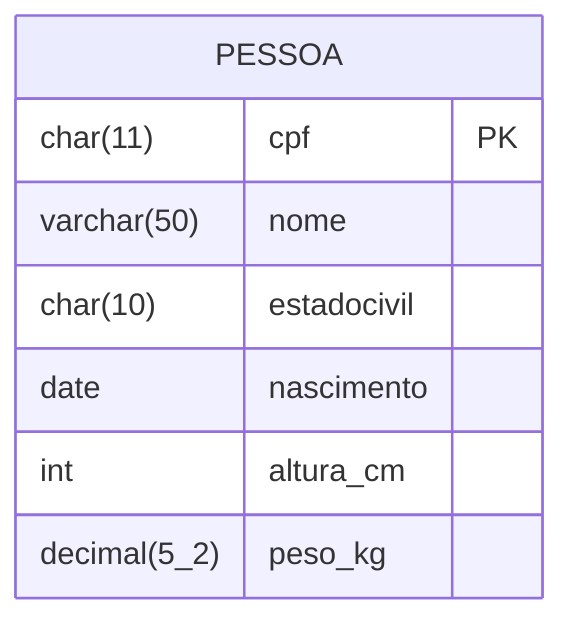
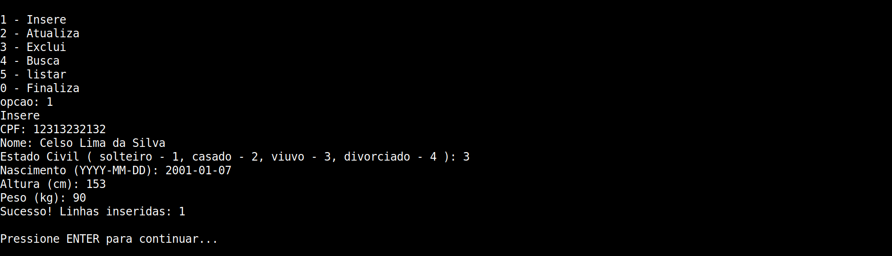
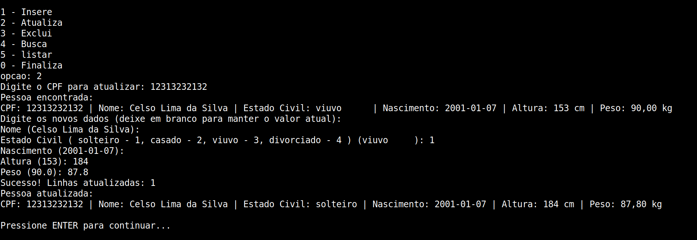
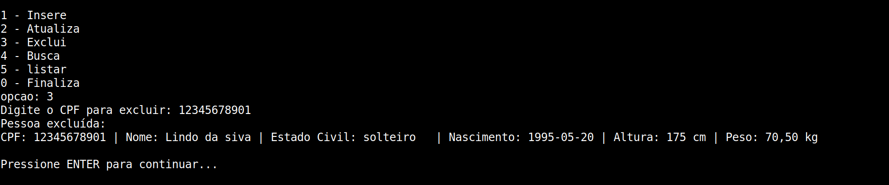
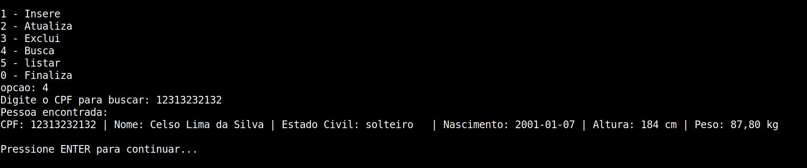
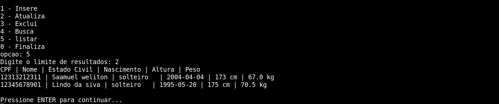

# Atividade 4 - JDBC

## Alunos 

Samuel Victor Alventino Silva - 12311BSI244

Keila Almeida Santana - 12321BSI213 


## Objetivo

Este programa implementa as operações básicas de CRUD sobre a tabela `pessoa` em PostgreSQL:

- inserção de registros
- atualização de valores
- remoção de registros
- busca por CPF
- listagem de registros

### Estrutura da Tabela


```SQL
create table pessoa (
    cpf char(11) primary key,
    nome varchar(50) not null,
    estadocivil char(10) check (estadocivil in
    ('solteiro','casado','viuvo','divorciado')),
    nascimento date,
    altura_cm int,
    peso_kg decimal(5,2)
);
```
## 📝 Respostas Teóricas

**Q: Como funciona o `PreparedStatement` e como é feita a passagem de parâmetros?**

**R:** O `PreparedStatement` é uma interface JDBC que envia a estrutura da consulta SQL para o banco de dados antes dos dados em si. Isso permite que o banco pré-compile a instrução, melhorando a performance e garantindo segurança contra ataques de *SQL Injection*.

O funcionamento baseia-se no uso de **placeholders**, representados pelo caractere `?`. A passagem de parâmetros é feita através dos métodos `set` (como `setString()`, `setInt()`, etc.), informando o índice posicional da interrogação (começando sempre em 1) e o valor que deve substituí-la.

**Exemplo de Código:**
```java
String sql = "UPDATE pessoa SET nome = ?, peso_kg = ? WHERE cpf = ?";

PreparedStatement pstmt = conn.prepareStatement(sql);

// O índice numérico (1, 2, 3) corresponde à ordem dos '?' na string sql
pstmt.setString(1, "Maria Souza"); // 1º '?' (nome)
pstmt.setDouble(2, 65.50);         // 2º '?' (peso_kg)
pstmt.setString(3, "10987654321"); // 3º '?' (cpf)

pstmt.executeUpdate();
```

**Q: Como o `PreparedStatement` poderia ser utilizado para carga (inclusão) de um arquivo com muitos registros?**

**R:** O ideal é utilizar o recurso de *batching*. Em vez de executar uma inserção por vez, os dados lidos do arquivo são agrupados na memória usando o método `addBatch()`. Após a leitura de um volume determinado de linhas, o comando `executeBatch()` é chamado, enviando todos os registros ao banco de dados em uma única transação de rede. 

**Exemplo de implementação:**
```java
// 1. Desativa o auto-commit
conn.setAutoCommit(false);

// 2. Prepara o statement e adiciona ao lote
PreparedStatement pstmt = conn.prepareStatement(sql);
for (Pessoa p : lista) {
    pstmt.setString(1, p.getCpf());
    // ...
    pstmt.addBatch();
}

// 3. Executa o lote e comita a transação
pstmt.executeBatch();
conn.commit();
````

## Como compilar e executar

O projeto pode ser compilado e executado pelo script `run.sh`.

Se preferir executar manualmente:

```bash
javac -cp postgresql-42.7.11.jar *.java
java -cp .:postgresql-42.7.11.jar Main
```

## Prints do programa em execução

Substitua os espaços abaixo pelos prints do programa rodando.

### 1. Menu principal


### 2. Inserção de registro



### 3. Atualização de registro



### 4. Remoção de registro



### 5. Busca de registro



### 6. Listagem de registros



## Observações

- O banco deve estar configurado conforme a conexão definida em `Conexao.java`.
- A tabela `pessoa` deve existir antes da execução do programa.
- Caso os prints sejam salvos em outra pasta, ajuste os caminhos das imagens neste arquivo.
